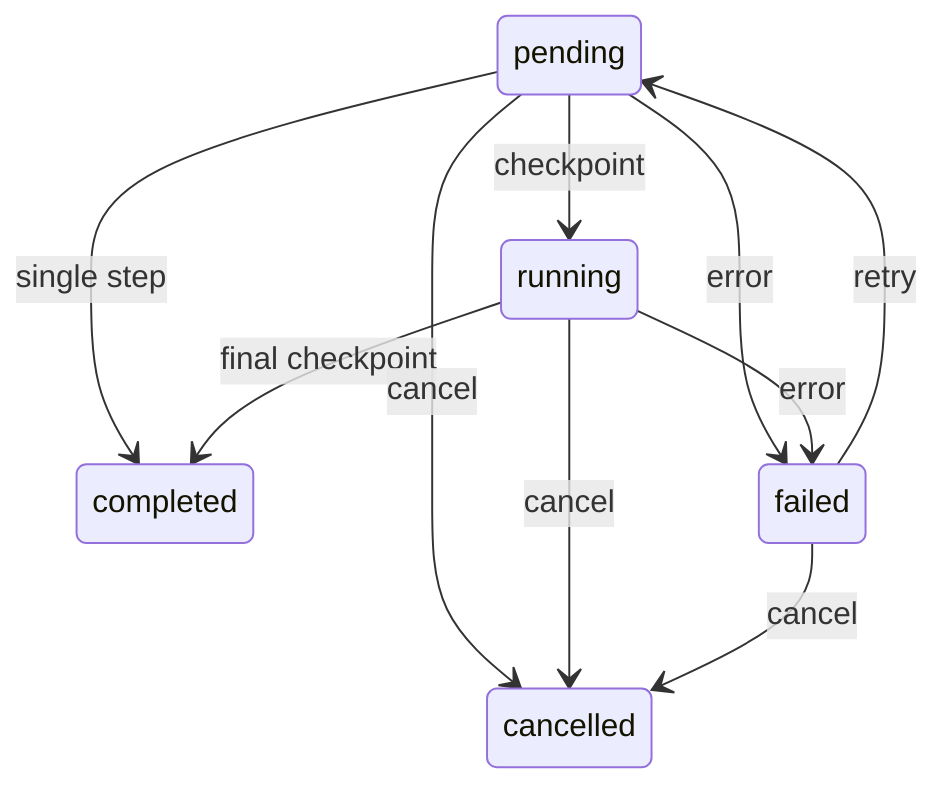

# 08 — Durable workflow engine

A directed acyclic graph (DAG) executor demonstrating graph validation,
idempotent creation, durable checkpoints, retries, cancellation and HTTP progress.
## Run with Docker

Set up `.env` once using the [Docker quick start](../README.md#start-with-docker).
Then run these commands from the repository root:

```bash
docker compose up -d --build workflow-engine
docker compose exec workflow-engine python clients/07-workflow-client.py
```

The client connects over HTTP and inherits the container's authentication token.
For a host Python setup, see [MANUAL.md](../MANUAL.md).

The client filters negatives, removes duplicates, deliberately fails a step once,
retries, then sums the results. Earlier steps stay at one attempt; the retried
step reaches two attempts.

## A branching pipeline

Call `create_workflow` with:

```json
{
  "request_key": "pipeline-demo-1",
  "values": [-2, 1, 3, 3],
  "steps": [
    {"name": "positive", "operation": "positive"},
    {"name": "unique", "operation": "unique", "depends_on": ["positive"]},
    {"name": "double", "operation": "scale", "factor": 2, "depends_on": ["positive"]},
    {"name": "total", "operation": "sum", "depends_on": ["unique", "double"]}
  ]
}
```

Roots read original values. Children concatenate dependency outputs in declared
order: the example's final sum is 18. Definitions can arrive out of order; the
server topologically sorts them and rejects missing dependencies, duplicate names
and cycles. Reusing a request key with identical arguments returns the same job;
a different definition causes a conflict.

Use the returned ID with `run_workflow(workflow_id, max_steps=1)` to checkpoint
one step. Call again to continue, or use the default to process up to 20 steps.
`get_workflow` returns status, attempts, errors and outputs. `retry_workflow`
resets only failed steps, allowing at most three attempts per step.
`cancel_workflow` prevents subsequent work while preserving committed outputs.
Completed and cancelled states are terminal.



Each bounded pure step and checkpoint execute inside one SQLite write
transaction. Competing callers serialize, so they cannot commit the same step
twice. A process failure before commit rolls the step back. The `fail_once`
operation is a deliberate retry demonstration; scale, positive, sort, unique and
sum perform actual transforms. Limits: 20 steps, 1,000 initial values, 10,000
values per step, and finite numeric outputs.

This is **request-driven execution**, not the MCP experimental Tasks protocol or
a background queue. Disconnecting can stop execution between checkpoints; call
run_workflow to resume. Cancellation cannot interrupt an in-flight atomic step.
Workers do not execute arbitrary code, network calls or shell commands. External
side effects would need an outbox and downstream idempotency; a database
transaction alone cannot make a remote operation exactly-once.

Compose persists `/app/data/workflows.db` in its named volume. A single SQLite
database is appropriate for this bounded example, not a distributed worker fleet.
