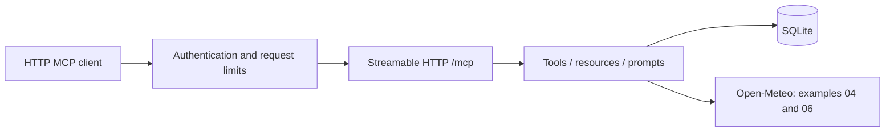

# MCP server and client examples

Nine Python examples, from two simple tools to transactional applications. Every
server exposes **remote Streamable HTTP at `/mcp`** and a liveness probe at
`/health`. Start a server separately, then connect a client by URL.

## Learning path

| # | Example | Default port | What it teaches |
|---|---|---:|---|
| 01 | [Hello world](01-hello-world/) | 8101 | Tools, typed inputs, remote initialization |
| 02 | [Remote basic](02-remote-basic/) | 8102 | Tools, resources and prompts |
| 03 | [Remote auth](03-remote-auth/) | 8103 | Required bearer authentication |
| 04 | [Tool features](04-tool-features/) | 8104 | Async upstream calls, structured results, progress and logging |
| 05 | [Task manager](05-task-manager/) | 8105 | Persistent SQLite CRUD and pagination |
| 06 | [Secure gateway](06-secure-gateway/) | 8106 | Bounded TTL caching, rate limiting, upstream failures |
| 07 | [Knowledge base](07-knowledge-base/) | 8107 | FTS5 search, immutable revisions, optimistic concurrency |
| 08 | [Workflow engine](08-workflow-engine/) | 8108 | DAG validation, durable checkpoints, retries, cancellation |
| 09 | [Inventory reservations](09-inventory-reservations/) | 8109 | Atomic multi-item reservations, idempotency, audit trails |

Examples 03 and 06–09 require a random token of at least 32 characters. Other
examples allow unauthenticated local experimentation; they also support the same
optional token. Production mode requires a token on **every** server.



## Run locally

Use Python 3.11 or newer; the tested environment and Docker image use Python 3.12.
From the repository root, PowerShell:

```powershell
python -m venv .venv
.\.venv\Scripts\python.exe -m pip install -r requirements.txt
.\.venv\Scripts\python.exe 01-hello-world/server.py
```

In another terminal:

```powershell
.\.venv\Scripts\python.exe clients/01-hello-client.py
```

Bash:

```bash
python3 -m venv .venv
.venv/bin/python -m pip install -r requirements.txt
.venv/bin/python 01-hello-world/server.py
# In another terminal:
.venv/bin/python clients/01-hello-client.py
```

For a protected example, generate a token, export it, and use the same token in
both server and client terminals. PowerShell:

```powershell
$env:MCP_AUTH_TOKEN = python -c "import secrets; print(secrets.token_hex(24))"
.\.venv\Scripts\python.exe 08-workflow-engine/server.py
```

Bash:

```bash
export MCP_AUTH_TOKEN=$(python -c 'import secrets; print(secrets.token_hex(24))')
.venv/bin/python 08-workflow-engine/server.py
```

Bare Python does **not** load `.env`. Compose does. Each example can be launched
from its own directory; imports locate `common/` relative to `server.py`.
Keep the repository together when copying examples, including `common/`.

## Docker

Copy `.env.example` to `.env` and set `MCP_AUTH_TOKEN` to a generated token.

```bash
docker compose up -d --build
docker compose ps
# Or launch only the workflow example:
docker compose up -d --build workflow-engine
```

All nine services share one image. Ports bind to `127.0.0.1`; all services run in
production mode with authentication. Containers run as UID 10001, with read-only
application files and writable named data volumes for examples 05, 07, 08 and 09.
`docker compose down` preserves those volumes; `down -v` deletes them.

Bare task-manager execution retains the existing `05-task-manager/tasks.db`
default (`TASKS_DB` overrides it). New examples write to repository `data/`
(`DATA_DIR` overrides it). Compose stores every database under `/app/data` in a
separate named volume. Back up SQLite databases consistently before moving them.

## Remote configuration

| Variable | Default | Meaning |
|---|---|---|
| `HOST` | `127.0.0.1` (Docker: `0.0.0.0`) | Listener address |
| `PORT` | Per-example port above | Listener port |
| `MCP_AUTH_TOKEN` | Empty | Shared bearer token; required in protected examples and production |
| `ENVIRONMENT` | Development unless set | `production` requires a token of at least 32 characters |
| `MCP_ALLOWED_HOSTS` | Localhost addresses only | Additional exact public hostnames, optionally with ports; comma-separated |
| `RATE_LIMIT_PER_MINUTE` | 120 | Request limit per socket peer IP, per process |
| `MAX_REQUEST_BYTES` | 1048576 | Body size ceiling; reading also has a 15-second deadline |
| `CACHE_TTL_SECONDS` | 300 | Gateway cache lifetime; maximum 256 entries |
| `TASKS_DB` | Beside task server | Task database path |
| `DATA_DIR` | Repository `data/` | New examples' database directory |

Clients use `MCP_URL` and `MCP_AUTH_TOKEN`. For example:

```bash
python clients/05-interactive-cli.py http://localhost:8107/mcp --list
claude mcp add --transport http knowledge-base http://localhost:8107/mcp \
  --header "Authorization: Bearer $MCP_AUTH_TOKEN"
```

For access from another machine, terminate HTTPS at a reverse proxy and set
`MCP_ALLOWED_HOSTS` to the public hostname, e.g. `knowledge.example.com`. Preserve
the original Host header. A proxy on the same host can reach loopback-published
ports; a containerized proxy can join the Compose network. A bare remote listener
may require `HOST=0.0.0.0`. Public DNS, TLS and hosting are not provisioned here.

Host and Origin validation remain enabled on `/mcp`. `/health` is intentionally
public and reports liveness only. Body limits apply even without Content-Length.
Rate limits trust the socket peer rather than forwarded headers: behind a proxy,
clients share its quota. Caches and rate limits are process-local, not distributed.

Static bearer tokens demonstrate service authentication. They do not implement
OAuth discovery, consent, scopes, user identity or tenant isolation. Use an SDK
client or a client that explicitly supports custom bearer headers. Hosted clients
that require OAuth need an OAuth implementation before these examples can connect.

## Advanced walkthroughs

- [Knowledge base](07-knowledge-base/README.md): create a document, search it,
  update at its current version, then try a stale write.
- [Workflow engine](08-workflow-engine/README.md): create a branching pipeline,
  checkpoint it, deliberately fail a step, retry, and inspect attempts/outputs.
  `python clients/07-workflow-client.py` runs the retry demonstration.
- [Inventory](09-inventory-reservations/README.md): receive stock, reserve several
  SKUs atomically, retry the request, then confirm or release the reservation.
  `python clients/08-inventory-client.py` writes sample stock to a test instance.

[Client guide](clients/README.md) also covers discovery, resources, prompts,
progress, a generic CLI, and an optional Claude tool-running agent. Only that
agent requires paid API credentials and the separate client requirements file.

## Validation

```bash
python -m unittest discover -s tests -v
python scripts/smoke_remote.py
docker build -t mcp-server-examples:local .
python scripts/smoke_containers.py
```

Unit tests cover transactional rollback, concurrency, retries, bounds and ingress
failures. HTTP tests launch all nine servers on ephemeral ports with temporary
databases, initialize SDK sessions and exercise tools, resources and progress.
Container tests exercise those same workflows as a non-root user on read-only
filesystems. Test containers are removed afterward; no user databases are mounted.
Weather calls are mocked in tests; smoke tests use local tools. API availability
and paid Claude inference are not prerequisites for the suite.

GitHub Actions runs the suite on Windows and Linux, plus Docker on Linux.

## Migration from the original examples

Example 01 now listens on `http://localhost:8101/mcp`. Its old subprocess client
was replaced by `clients/01-hello-client.py`. Replace command/args client entries
with a Streamable HTTP URL. There are no remaining stdio server entry points.
All bare listeners now default to loopback; Docker no longer publishes open ports
on every interface. Existing task databases remain compatible. Configure longer
tokens if an old token has fewer than 32 characters.

The shared runtime uses `FastMCP.streamable_http_app()` served by Uvicorn.
See the [MCP Python SDK](https://github.com/modelcontextprotocol/python-sdk/tree/v1.28.1)
and [Anthropic tool runner](https://github.com/anthropics/anthropic-sdk-python/blob/main/tools.md)
for the underlying APIs. The runtime explicitly routes progress notifications to
the active POST stream because SDK 1.28.1's context helper does not do so in
stateless HTTP mode.
