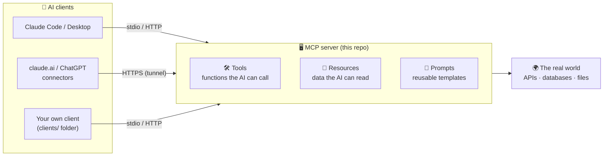
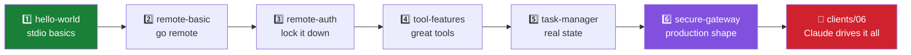
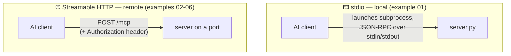
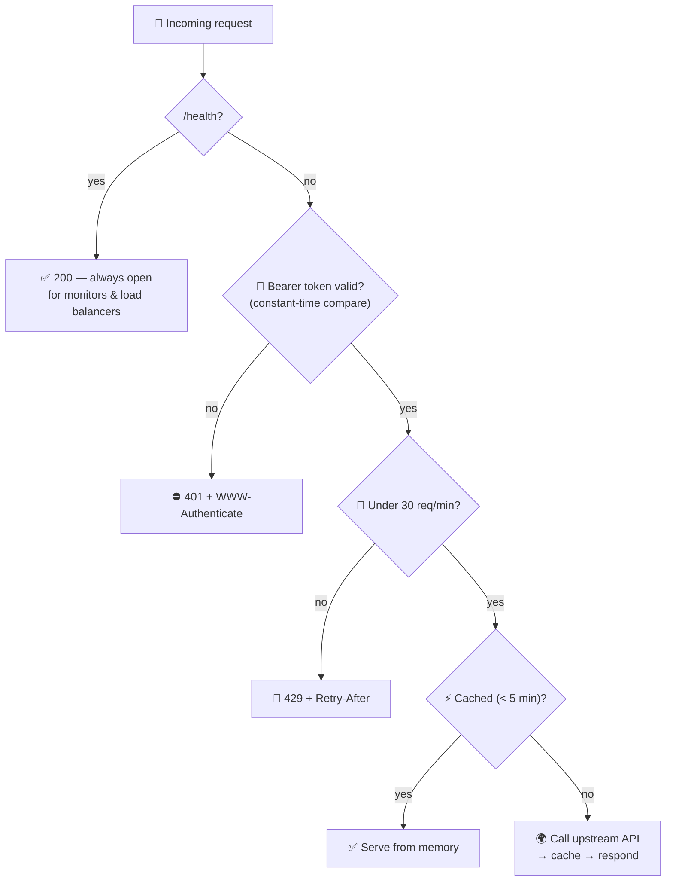
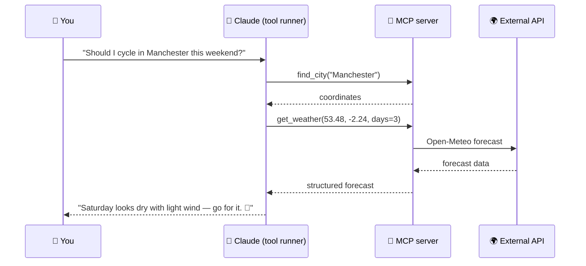

# 🔌 MCP Server & Client Examples

A graded collection of [Model Context Protocol](https://modelcontextprotocol.io)
**servers and clients**, from "hello world" to a production-shaped secure API
gateway and a Claude-powered agent. Every example works with **Claude**
(Claude Code, Claude Desktop, claude.ai connectors) and **ChatGPT**
(developer-mode connectors), because they all use the transports those clients
speak: **stdio** for local servers and **Streamable HTTP** for remote ones.

## 🗺️ The big picture

MCP is the USB port between AI models and your code: the client (an AI app)
discovers what a server offers and calls it on the model's behalf.



## 📚 The learning path

Work through them in order — each README explains the new concepts it adds.

### 🖥️ Servers

| # | Example | Transport | Auth | What it teaches |
|---|---------|-----------|------|-----------------|
| 1️⃣ | [hello-world](01-hello-world/) | stdio | — | 🐣 The absolute minimum: one file, two tools |
| 2️⃣ | [remote-basic](02-remote-basic/) | Streamable HTTP | none | 🌐 A remote server: tools + a resource + a prompt |
| 3️⃣ | [remote-auth](03-remote-auth/) | Streamable HTTP | 🔑 bearer token | 🔒 The same server, locked down properly |
| 4️⃣ | [tool-features](04-tool-features/) | Streamable HTTP | none | ⚙️ Typed params, structured output, errors, async HTTP calls, progress + logging |
| 5️⃣ | [task-manager](05-task-manager/) | Streamable HTTP | none | 💾 A stateful app: SQLite-backed CRUD the AI can drive |
| 6️⃣ | [secure-gateway](06-secure-gateway/) | Streamable HTTP | 🔑 bearer token | 🏰 Everything combined: auth + external API + caching + rate limiting + health endpoint |

### 🔍 Clients — [`clients/`](clients/)

| # | Client | Pairs with | What it teaches |
|---|--------|------------|-----------------|
| 1️⃣ | [stdio client](clients/01-stdio-client.py) | server 01 | 🐣 Launch a server subprocess; initialize → list → call |
| 2️⃣ | [HTTP client](clients/02-http-client.py) | server 02 | 🌐 Remote connections; resources and prompts |
| 3️⃣ | [auth client](clients/03-auth-client.py) | server 03 | 🔑 Bearer-token headers; handling rejection |
| 4️⃣ | [advanced client](clients/04-advanced-client.py) | server 04 | 📊 Live progress bars + server log streaming |
| 5️⃣ | [interactive CLI](clients/05-interactive-cli.py) | any server | 🧰 A generic inspector for any MCP URL |
| 6️⃣ | [**Claude agent**](clients/06-claude-agent.py) | any server | 🤖 The full agentic loop: Claude plans and calls your tools |



## 🚚 Two transports, one protocol



- **stdio** → Claude Desktop & Claude Code launch the server themselves. No
  port, no auth needed — only your machine can reach it.
- **Streamable HTTP** → a real network service. claude.ai and ChatGPT
  connectors need this (over an HTTPS tunnel), and it's what you secure in
  examples 03 and 06.

## ⚡ Quick start

### Run one example directly

```bash
pip install -r requirements.txt
python 02-remote-basic/server.py
# -> Streamable HTTP MCP server on http://localhost:8102/mcp
```

### Run all the remote examples at once (Docker) 🐳

```bash
cp .env.example .env      # then set MCP_AUTH_TOKEN (e.g. openssl rand -hex 24)
docker compose up -d --build
```

| Example | URL |
|---|---|
| 2️⃣ remote-basic | `http://localhost:8102/mcp` |
| 3️⃣ remote-auth | `http://localhost:8103/mcp` |
| 4️⃣ tool-features | `http://localhost:8104/mcp` |
| 5️⃣ task-manager | `http://localhost:8105/mcp` |
| 6️⃣ secure-gateway | `http://localhost:8106/mcp` |

## 🔗 Connecting the AI clients

### Claude Code (CLI)

```bash
# local stdio server
claude mcp add hello -- python 01-hello-world/server.py

# remote server, no auth
claude mcp add --transport http remote-basic http://localhost:8102/mcp

# remote server with bearer auth
claude mcp add --transport http remote-auth http://localhost:8103/mcp \
  --header "Authorization: Bearer <MCP_AUTH_TOKEN>"
```

### Claude Desktop (local stdio servers)

Add to `claude_desktop_config.json`:

```json
{
  "mcpServers": {
    "hello": {
      "command": "python",
      "args": ["C:/path/to/mcp-server-examples/01-hello-world/server.py"]
    }
  }
}
```

### claude.ai and ChatGPT (remote connectors) 🌍

Both need a **publicly reachable HTTPS URL**. From your machine, tunnel one
example:

```bash
cloudflared tunnel --url http://localhost:8102     # or: ngrok http 8102
```

Then add `https://<tunnel-host>/mcp` as a custom connector. For the
authenticated examples (03, 06), also supply the
`Authorization: Bearer <token>` header in the connector's auth settings.

> 💡 ChatGPT: connectors are added under Settings → Connectors (developer mode
> must be enabled for custom MCP connectors).

## 🔐 The security ladder

What a request goes through in the capstone gateway (example 06):



- 1️⃣–2️⃣ have **no auth**. Fine for localhost experiments; never tunnel these.
- 3️⃣ shows the minimum viable protection: a static bearer token checked in
  constant time, and a server that **refuses to start** without one.
- 6️⃣ adds the rest: rate limiting, an open `/health` probe, upstream caching.
- ⚠️ Plain HTTP means the token is visible on-path — for anything beyond your
  LAN, terminate TLS in front (a cloudflared/ngrok tunnel does this for you).

## 🤖 The agentic loop (client 06)

What actually happens when Claude drives your MCP server:



## 📦 Requirements

- 🐍 Python 3.11+ — `pip install -r requirements.txt`
  (the `mcp` SDK, `httpx`, `uvicorn`, and `anthropic[mcp]` for client 06)
- 🐳 Docker Desktop only if you want the compose setup
- 🔑 An [Anthropic API key](https://console.anthropic.com) only for client 06
